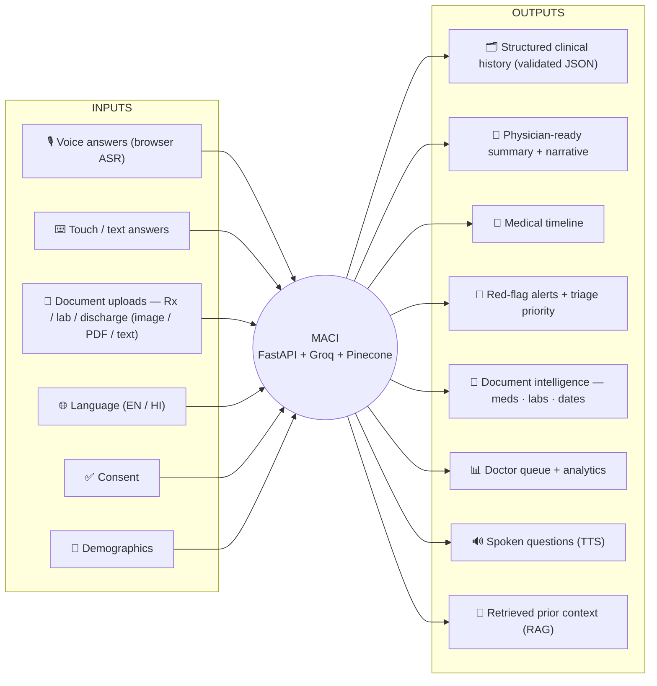

<div align="center">

# 🩺 MACI

### Multilingual AI Clinical Intake Platform

**“Smarter Patient Intake. Better Clinical Conversations.”**

An AI‑powered clinical intake platform: a patient shares their medical history by **voice or touch/text**,
uploads **prescriptions / lab reports / discharge summaries**, and the doctor gets an **AI‑generated,
structured, physician‑ready summary** — on a professional dashboard, *before* the consultation.

> The AI **collects history and drafts**. It does **not** diagnose.

<br/>


<br/>

**[▶ Live App](https://frontend-git-main-harsh-sachans-projects-88b7d3c9.vercel.app/)** ·
**[⚙ Live API](https://backend-git-main-harsh-sachans-projects-88b7d3c9.vercel.app/)** ·
**[📘 API Docs](https://backend-trfg.vercel.app/docs)** ·
**[🏗 Architecture](docs/ARCHITECTURE.md)** ·
**[🗂 Data Guide](data/README_DATA.md)**

</div>

---

## 🚀 Live demo

| What | URL |
|---|---|
| 🖥️ **Patient portal + Doctor dashboard** (frontend) | <https://frontend-git-main-harsh-sachans-projects-88b7d3c9.vercel.app/> |
| ⚙️ **REST API** (backend) | <https://backend-git-main-harsh-sachans-projects-88b7d3c9.vercel.app/> |
| 📘 **Swagger / OpenAPI docs** | <https://backend-trfg.vercel.app/docs> |
| ❤️ **Health check** | <https://backend-trfg.vercel.app/health> → `{"status":"ok","service":"MACI API"}` |
| 🔎 **Capability probe** | <https://backend-trfg.vercel.app/api/health/details> |

> [!NOTE]
> The `*-git-main-*.vercel.app` URLs have **Vercel Deployment Protection** on, so opening them may ask
> you to sign in to Vercel. `https://backend-trfg.vercel.app` is the always‑public API alias.
> To make the branch URLs public: *Vercel → Project → Settings → Deployment Protection → off*.

---

## 📑 Table of contents

- [Why MACI](#-why-maci)
- [Features](#-features)
- [Screenshots](#-screenshots)
- [Architecture](#-architecture)
- [Tech stack](#-tech-stack)
- [Quick start](#-quick-start)
- [Configuration](#-configuration-environment-variables)
- [Integrations setup](#-integrations-setup-supabase--pinecone--groq--ocrspace)
- [Deployment (Vercel)](#-deployment-vercel)
- [Project structure](#-project-structure)
- [API reference](#-api-reference)
- [Dataset import](#-dataset-import)
- [Testing](#-testing)
- [Security & compliance](#-security--compliance)
- [Limitations & roadmap](#-limitations--roadmap)
- [Contributing](#-contributing)
- [License](#-license)

---

## 💡 Why MACI

Clinicians routinely start a consultation with almost no structured information. History‑taking eats into
appointment time, prior documents arrive as unstructured scans, language barriers slow everything down,
and a genuine emergency can sit unnoticed in a waiting room.

**MACI front‑loads the intake** so the clinician walks in already informed — with a structured history, a
document summary, a medical timeline, red‑flag alerts, and a triage priority. It runs **with or without**
external API keys: every integration has a deterministic offline fallback, so the app (and its whole test
suite) always works.

---

## ✨ Features

| | Feature | What it does |
|---|---|---|
| 🧠 | **AI clinical history interview** | Adaptive, **one question at a time** (SOCRATES & friends). Covers chief complaint, HPI, PMH/PSH, medications, allergies, family & social history, ROS, prior investigations. |
| 🧾 | **Structured, validated output** | The LLM **must** return JSON matching a Pydantic schema. Malformed JSON is repaired via a retry loop or safely rejected — downstream code only ever sees a valid object. |
| 🚨 | **Deterministic red‑flag safety layer** | A rule/regex engine with negation handling runs on **every message** and on the final summary — *independent of the LLM*. Emergencies mark the session **HIGH PRIORITY** and raise dashboard alerts. |
| 💊 | **Medical document intelligence** | Upload image / PDF / text → **OCR.Space** → LLM (or heuristic) structuring → medicines, doses, frequencies, lab results, reference ranges, dates, diagnoses. Fully **user‑correctable**. |
| 📅 | **Medical timeline** | Dates are extracted from documents and arranged chronologically, ending at the current visit. |
| 🔎 | **RAG with strict patient isolation** | Document chunks, summaries and histories are embedded into **Pinecone** and retrieved semantically — always scoped by a **per‑patient namespace + mandatory `patient_id` filter** (`query()` refuses to run without one). |
| 🎙️ | **Multilingual voice** | Browser Web Speech API for ASR + speech synthesis for TTS. **English + Hindi**, with a modular seam to add more Indian languages / a server ASR provider. |
| 🩺 | **Doctor dashboard** | Prioritised queue, red‑flag badges, **editable** AI summary (confirm / reject / notes), timeline, document intelligence, AI attention points, analytics cards + Recharts. |
| 🌿 | **AYUSH mode** | Optional Ayurveda intake (Prakriti, Vikriti, Sara, Samhanana, Ahara Shakti …) kept cleanly separate from the biomedical flow. |
| 🪪 | **ABDM / ABHA interface** | Typed stubs for a *future / sandbox* integration (ABHA lookup, consent, FHIR export, HIS push). Nothing is transmitted. |
| ✅ | **Consent‑gated** | A consent record is required before an intake session can be created. |

---

## 🖼️ Screenshots

> Drop images into `docs/` and they’ll render here.

| | |
|---|---|
|  |  |
| **Landing page** | **Patient kiosk — adaptive interview** |
|  |  |
| **Document intelligence + OCR correction** | **Doctor dashboard — queue + analytics** |

---

## 🏗️ Architecture

> Full diagram set (component, sequence, ER schema, red‑flag decision flow, RAG isolation, deployment,
> state machine) lives in **[`docs/ARCHITECTURE.md`](docs/ARCHITECTURE.md)**.

### System flow


### Input → MACI → Output



### Graceful degradation

| If this is missing / down… | …MACI falls back to |
|---|---|
| **Groq** | Deterministic scripted interview + template summary + heuristic document structuring |
| **OCR.Space** | Text uploads read directly; other formats prompt “enter text manually” |
| **Pinecone** | In‑process cosine‑similarity vector store (same isolation guarantees) |
| **Supabase** | In‑memory repository (data lives for the process lifetime only) |
| **Embedding model** | Offline deterministic hashing embedder (auto‑matches the Pinecone index dimension) |

---

## 🧰 Tech stack

| Layer | Choices |
|---|---|
| **Frontend** | React 18 · Vite 5 · Tailwind CSS 3 · React Router 6 · Recharts · lucide‑react · react‑hot‑toast · Web Speech API |
| **Backend** | Python 3.11+ · FastAPI · Pydantic v2 · pydantic‑settings · httpx · Uvicorn |
| **Database** | Supabase / PostgreSQL (system of record) |
| **Vector DB / RAG** | Pinecone (semantic retrieval only — never the system of record) |
| **LLM** | Groq (OpenAI‑compatible Chat Completions, JSON mode + repair loop) |
| **OCR** | OCR.Space API |
| **Embeddings** | Pluggable: `fastembed` / `sentence-transformers` / offline hashing (default) |
| **Tests** | pytest · pytest‑asyncio — **all external APIs mocked, zero quota used** |
| **Deploy** | Vercel (frontend static + backend Python serverless), Docker Compose for local |

---

## ⚡ Quick start

**Prerequisites:** Python 3.11+ and Node 18+.

```bash
git clone https://github.com/hsachan295-source/MACI-AI-Clinical-Intake.git
cd MACI-AI-Clinical-Intake
cp .env.example .env          # fill in whatever keys you have — all optional
```

<table>
<tr><td>

**Backend** — terminal 1

```bash
cd backend
python -m venv .venv
# Windows:  .venv\Scripts\activate
# Unix:     source .venv/bin/activate
pip install -r requirements-dev.txt
uvicorn app.main:app --reload --port 8000
# → http://localhost:8000/docs
```

</td><td>

**Frontend** — terminal 2

```bash
cd frontend
npm install
cp .env.example .env          # VITE_API_BASE_URL=http://localhost:8000
npm run dev
# → http://localhost:5173
```

</td></tr>
</table>

```bash
# optional: load a tiny demo dataset so the dashboard has patients
python scripts/seed_demo_data.py
```

**Or one command with Docker:**

```bash
docker compose up --build       # frontend :5173 · backend :8000
```

---

## 🔧 Configuration (environment variables)

All secrets are **backend‑only**. The frontend only ever sees `VITE_API_BASE_URL` (a public URL, no secret).
`GET /api/health/details` reports which integrations are active — **booleans only, never key values**.
**Every value has a safe default — the app never crashes because a variable is missing or blank.**

<details>
<summary><b>Backend variables</b> (repo‑root <code>.env</code> — see <a href="./.env.example"><code>.env.example</code></a>)</summary>

<br/>

| Variable | Required? | Notes |
|---|---|---|
| `GROQ_API_KEY` | optional | LLM. Without it → scripted interview + template summary. |
| `GROQ_MODEL` | optional | Default `openai/gpt-oss-20b`. `python scripts/check_groq.py` lists what your key can use. |
| `OCR_SPACE_API_KEY` | optional | Document OCR. `OCR_SPACE_API_URL` defaults to the public endpoint. |
| `PINECONE_API_KEY` · `PINECONE_HOST` · `PINECONE_INDEX_NAME` | optional | RAG. `PINECONE_DIMENSION` should match your index (the offline embedder auto‑adapts at runtime). |
| `SUPABASE_URL` · `SUPABASE_PUBLISHABLE_KEY` | optional | Persistence. Legacy names `SUPABASE_KEY` / `SUPABASE_ANON_KEY` and `SUPABASE_SECRET_KEY` / `SUPABASE_SERVICE_KEY` are all accepted. |
| `EMBEDDING_PROVIDER` | optional | `auto` \| `fastembed` \| `sentence-transformers` \| `hash` (offline default). |
| `CORS_ORIGINS` | optional | Default `*`. Set to your frontend URL in production. |
| `APP_DEBUG` · `API_PORT` · `MAX_UPLOAD_MB` · `MAX_INTERVIEW_QUESTIONS` · `LLM_MAX_RETRIES` | optional | Defaults: `false` · `8000` · `10` · `20` · `3`. |

</details>

<details>
<summary><b>Frontend variables</b> (<code>frontend/.env</code>)</summary>

<br/>

| Variable | Notes |
|---|---|
| `VITE_API_BASE_URL` | Base URL of the backend. Local: `http://localhost:8000`. On Vercel: leave **empty** — `frontend/vercel.json` proxies `/api/*` to the backend — or set it to `https://backend-trfg.vercel.app`. |

</details>

---

## 🔌 Integrations setup (Supabase · Pinecone · Groq · OCR.Space)

<details>
<summary><b>Supabase</b> — persistence (full guide: <a href="supabase/README.md"><code>supabase/README.md</code></a>)</summary>

<br/>

1. Create a project at <https://app.supabase.com>.
2. **SQL Editor → paste [`supabase/migrations/0001_init.sql`](supabase/migrations/0001_init.sql) → Run.** (Or `supabase db push`.) The migration is **idempotent**.
3. Put `SUPABASE_URL` + `SUPABASE_PUBLISHABLE_KEY` in `.env`, restart the backend. Startup logs `Using Supabase repository`; `/api/health/details` shows `"repository": "supabase"`.

RLS is intentionally **disabled** for the prototype (single server‑side key + repository‑level patient isolation). Production requires enabling RLS with per‑role policies — see the commented block at the end of the migration.

Tables: `patients, consents, clinical_sessions, clinical_answers, medical_histories, documents, ocr_results, medications, allergies, lab_results, clinical_summaries, alerts, ayush_assessments`.

</details>

<details>
<summary><b>Pinecone</b> — vector DB / RAG</summary>

<br/>

1. Create an index at <https://app.pinecone.io> (metric `cosine`). Note its **dimension**.
2. Set `PINECONE_API_KEY`, `PINECONE_HOST` (or `PINECONE_INDEX_NAME`), and `PINECONE_DIMENSION` to your index’s dimension.
3. `python scripts/index_pinecone.py --create-index` creates it for you if missing.

The offline embedder auto‑adapts to the live index dimension. Retrieval is **always** scoped by a per‑patient namespace **and** a `patient_id` metadata filter.

</details>

<details>
<summary><b>Groq</b> — LLM</summary>

<br/>

Get a key at <https://console.groq.com/keys>, set `GROQ_API_KEY`, then:

```bash
python scripts/check_groq.py     # lists models your key can use + tests JSON mode
```

Set `GROQ_MODEL` to one of the listed ids (default `openai/gpt-oss-20b`; `openai/gpt-oss-120b` for higher quality). All Groq calls use JSON mode with a retry + repair loop.

</details>

<details>
<summary><b>OCR.Space</b> — document OCR</summary>

<br/>

Get a free key at <https://ocr.space/ocrapi>, set `OCR_SPACE_API_KEY`. `OCR_SPACE_API_URL` defaults to `https://api.ocr.space/parse/image`. Without a key, plain‑text / CSV / JSON uploads are read directly and other formats prompt the user to type the text (which is then structured normally).

</details>

---

## ☁️ Deployment (Vercel)

The **frontend** and **backend** are two separate Vercel projects from this one repo.

| Project | Vercel **Root Directory** | Framework preset | Serves |
|---|---|---|---|
| **frontend** | `frontend` | **Vite** (Output `dist`) | React SPA · `frontend/vercel.json` proxies `/api/*` → the backend and falls back to `index.html` for client‑side routes |
| **backend** | `backend` | **Other** | FastAPI via `backend/api/index.py` (`from app.main import app`) · `backend/vercel.json` routes all paths to it |

**Backend serverless notes** (all handled in code):

- No ASGI `lifespan` / startup hook — nothing touches the network, DB or filesystem at import time. Every integration is created lazily on first use and degrades to an offline fallback.
- `Settings` uses `env_ignore_empty=True`, so a **defined‑but‑blank** Vercel env var (`""`) falls back to its typed default instead of raising `ValidationError` at import.
- Uploads go to the system temp dir (`/tmp`) on serverless — the project directory is read‑only.
- `backend/vercel.json` carries the request path through the rewrite as `?__vpath=…`, restored by a tiny ASGI middleware, because Vercel `rewrites` otherwise drop the original path.

**Set these env vars in the Vercel *backend* project** (Settings → Environment Variables):
`GROQ_API_KEY`, `GROQ_MODEL`, `OCR_SPACE_API_KEY`, `OCR_SPACE_API_URL`, `PINECONE_API_KEY`, `PINECONE_HOST`,
`PINECONE_INDEX_NAME`, `PINECONE_DIMENSION`, `SUPABASE_URL`, `SUPABASE_PUBLISHABLE_KEY`, `SUPABASE_SECRET_KEY`,
`CORS_ORIGINS` (= your frontend URL). Leave the numeric/bool ones unset unless you want non‑default values.

**Live URLs**

```
Frontend  https://frontend-git-main-harsh-sachans-projects-88b7d3c9.vercel.app/
Backend   https://backend-git-main-harsh-sachans-projects-88b7d3c9.vercel.app/
API alias https://backend-trfg.vercel.app/        (public, no Vercel login)
API docs  https://backend-trfg.vercel.app/docs
```

---

## 📁 Project structure

<details>
<summary>Expand tree</summary>

```
MACI-AI-Clinical-Intake/
├── backend/
│   ├── app/
│   │   ├── api/
│   │   │   ├── routes/            # health · patients · sessions · history · voice ·
│   │   │   │                      # documents · triage · doctor · summaries · ayush · abdm
│   │   │   ├── deps.py  router.py  serializers.py
│   │   ├── core/                  # config · logging (redaction) · errors · vercel middleware
│   │   ├── models/entities.py     # persisted-entity models (mirror the DB)
│   │   ├── schemas/               # Pydantic request/response + validated LLM output
│   │   ├── services/              # groq · ocr · pinecone · embedding · red_flag ·
│   │   │                          # clinical_interview · summary · timeline · document · doctor · voice · abdm
│   │   ├── repositories/          # base + in-memory + supabase
│   │   └── main.py                # FastAPI app (no lifespan; serverless-safe)
│   ├── api/index.py               # Vercel Python entrypoint → from app.main import app
│   ├── tests/                     # 76 tests, external APIs mocked
│   ├── requirements.txt  requirements-dev.txt  vercel.json  Dockerfile
│
├── frontend/
│   ├── src/
│   │   ├── components/  (ui · layout · intake · doctor)
│   │   ├── lib/         (api · i18n · useVoice · format · constants)
│   │   ├── pages/       (Landing · PatientIntake · DoctorDashboard · DoctorPatient · NotFound)
│   │   └── App.jsx  main.jsx  index.css
│   ├── vercel.json  vite.config.js  tailwind.config.js  Dockerfile  nginx.conf
│
├── scripts/            # seed_demo_data · import_dataset · index_pinecone · check_groq
├── data/               # README_DATA.md · demo/ (tiny) · real/ (git-ignored, your dataset)
├── supabase/migrations/0001_init.sql   # full schema (idempotent)
├── docs/ARCHITECTURE.md                # all Mermaid diagrams
├── .env.example  docker-compose.yml  README.md
```

</details>

---

## 📚 API reference

Interactive docs: **`/docs`** (Swagger) and **`/redoc`**.

<details>
<summary>Key endpoints</summary>

<br/>

| Method & path | Purpose |
|---|---|
| `GET /` · `GET /health` | Root / liveness — plain JSON, zero dependencies |
| `GET /api/health/details` | Active integrations + runtime backends (booleans only) |
| `POST /api/patients` · `GET /api/patients/{id}` · `PATCH …` | Patients |
| `POST /api/patients/{id}/consent` | Record consent (required before a session) |
| `POST /api/sessions` · `GET /api/sessions/{id}` · `PATCH …` | Intake sessions |
| `GET /api/sessions/{id}/interview` · `POST /api/sessions/{id}/submit` | Transcript · submit to doctor |
| `POST /api/history/message` | One adaptive interview turn (+ deterministic triage) |
| `POST /api/history/generate-summary` | Build the structured physician‑ready summary |
| `POST /api/voice/transcript` · `POST /api/voice/speak` | Voice ASR intake · TTS params |
| `POST /api/documents/upload` · `POST /api/documents/{id}/process` · `GET/PATCH /api/documents/{id}` | Upload · OCR + structure · fetch · correct |
| `POST /api/triage/check` | Deterministic (optionally + LLM) red‑flag screen |
| `GET /api/doctor/queue` · `GET /api/doctor/analytics` | Dashboard queue · analytics |
| `GET /api/doctor/patients/{id}/summary` | Full patient view (overview, summary, docs, timeline, AYUSH) |
| `POST /api/doctor/sessions/{id}/reviewed` | Mark patient reviewed |
| `GET /api/summaries/{id}` · `PATCH …` · `POST …/confirm` · `POST …/reject` | Review the AI summary |
| `POST /api/ayush/assessment` · `GET /api/ayush/assessment/{session_id}` | AYUSH mode |
| `GET /api/abdm/status` · `POST /api/abdm/abha/lookup` · `GET /api/abdm/fhir/{session_id}` | **Future / sandbox** stubs |

</details>

---

## 🗂 Dataset import

Nothing large is bundled — only a tiny demo. Provide your dataset later and import it **without changing
app code**. Full guide: **[`data/README_DATA.md`](data/README_DATA.md)**.

```bash
python scripts/seed_demo_data.py                                   # tiny demo
python scripts/import_dataset.py --path data/real/intake.jsonl --dry-run
python scripts/import_dataset.py --path data/real/intake.jsonl     # CSV / JSON / JSONL
python scripts/index_pinecone.py --all                             # (re)build the vector index
```

Put your real files in **`data/real/`** (git‑ignored). Document scans can also be uploaded through the
running app at `POST /api/documents/upload`.

---

## 🧪 Testing

```bash
cd backend && pytest            # 76 tests, ~1.5s, zero API quota (all externals mocked/faked)
```

Covers: API health, patient creation & validation, clinical‑history schema coercion, **malformed‑LLM‑JSON
repair**, OCR result parsing, document validation, **deterministic red‑flag detection**, **patient
isolation** (vector store refuses a query without `patient_id`), summary generation, the full
patient → interview → document → summary → doctor flow, blank/empty‑env‑var handling, and a subprocess
`from app.main import app` import check.

Frontend: `cd frontend && npm run build` (also `npm run lint`).

---

## 🔐 Security & compliance

Prototype‑level, defence‑in‑depth:

- Secrets are **backend‑only**; `.env` is git‑ignored; `.env.example` has placeholder names only.
- All paid / external API calls happen **server‑side**. Health endpoints never return key values.
- Logging has a **redaction filter** for key patterns and obvious PII; patient content is not logged.
- Upload validation: extension + MIME allow‑list, size limit, empty‑file rejection.
- Input validation everywhere via Pydantic; errors return a small safe envelope (no stack traces).
- **Patient isolation**: repository‑level ownership checks + Pinecone per‑patient namespace + a
  mandatory `patient_id` metadata filter on every retrieval.
- **Consent** is recorded before a session can start.
- The patient is never told an AI diagnosis is confirmed; red‑flag messaging is *“contact medical staff”*, not a diagnosis.

> [!WARNING]
> **Not certified.** This prototype is **not** HIPAA, India DPDP, or ABDM compliant / certified.
> Production deployment requires enabling RLS, encryption at rest & in transit, audit logging, PII
> minimisation, auth/RBAC, and a **formal security & compliance review**.

---

## 🧭 Limitations & roadmap

<details>
<summary>Known limitations</summary>

- The AI **collects history and drafts**; it does not diagnose, triage definitively, or treat.
- Voice uses the **browser** Web Speech API — quality and language support vary by browser (Chrome is best); there is no server ASR yet.
- The default embedder is a deterministic **hash** embedder — stable and offline, but not semantically rich. Install `fastembed` / `sentence-transformers` and set `EMBEDDING_PROVIDER` for real embeddings.
- Heuristic document structuring (no‑LLM fallback) is regex‑based and best‑effort.
- Without Supabase, data is **in‑memory** and lost when the process stops.
- ABDM/ABHA is a **stub** — no real gateway calls.
- No auth/RBAC yet — the doctor dashboard is open in the prototype.

</details>

<details>
<summary>Roadmap</summary>

- Auth + RBAC (patient / clinician / admin), Supabase RLS policies, audit trail.
- Server‑side multilingual ASR/TTS behind the existing modular voice seam; more Indian languages.
- Real ABDM sandbox integration (ABHA, consent artefacts, FHIR R4 bundles, HIS push).
- Better retrieval: real embedding model by default, hybrid search, re‑ranking.
- Clinician feedback loop to tune prompts; structured coding (SNOMED / LOINC / ICD).
- FHIR export of the confirmed summary; EMR write‑back.
- Admin console (users, departments, templates, analytics export).
- Load / soak testing; observability; formal security & compliance review.

</details>

---

## 🤝 Contributing

Issues and PRs welcome. For a change of any size:

```bash
git checkout -b feat/your-change
cd backend && pytest            # keep tests green
cd ../frontend && npm run build # keep the build green
```

Then open a PR against `main`.

---

## 📄 License

No license file yet — treat this as an **educational prototype**, all rights reserved, until a `LICENSE`
is added. If you plan to build on it, open an issue first.

---

<div align="center">

Built with FastAPI · React · Groq · Pinecone · Supabase · OCR.Space — deployed on Vercel.

**MACI is a prototype. It assists clinical history collection and drafts a summary for a clinician. It does not diagnose.**

</div>
