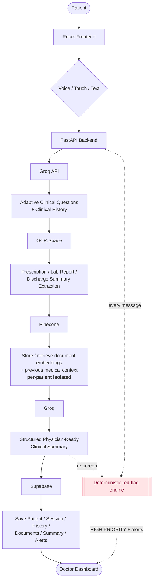
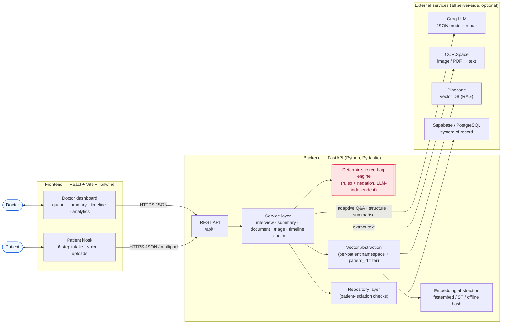
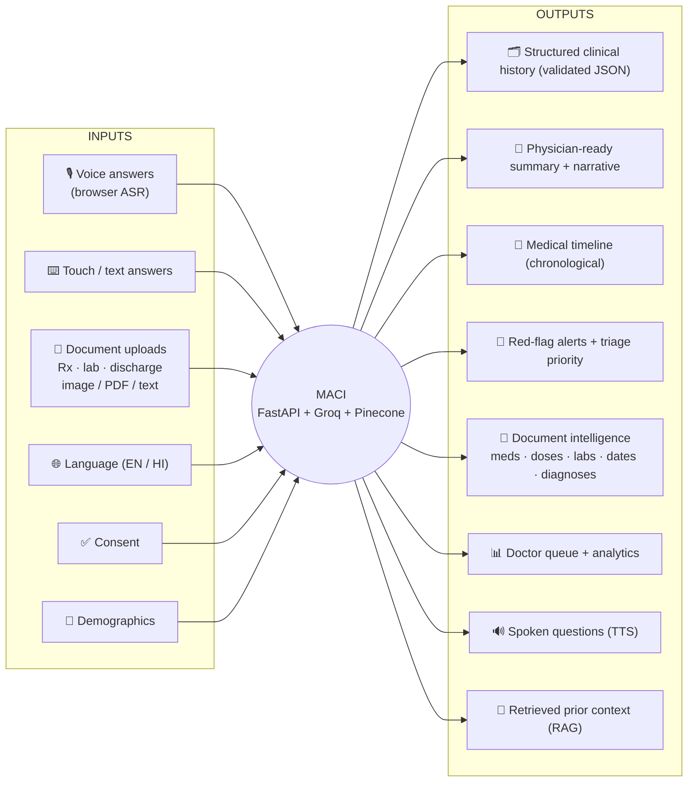
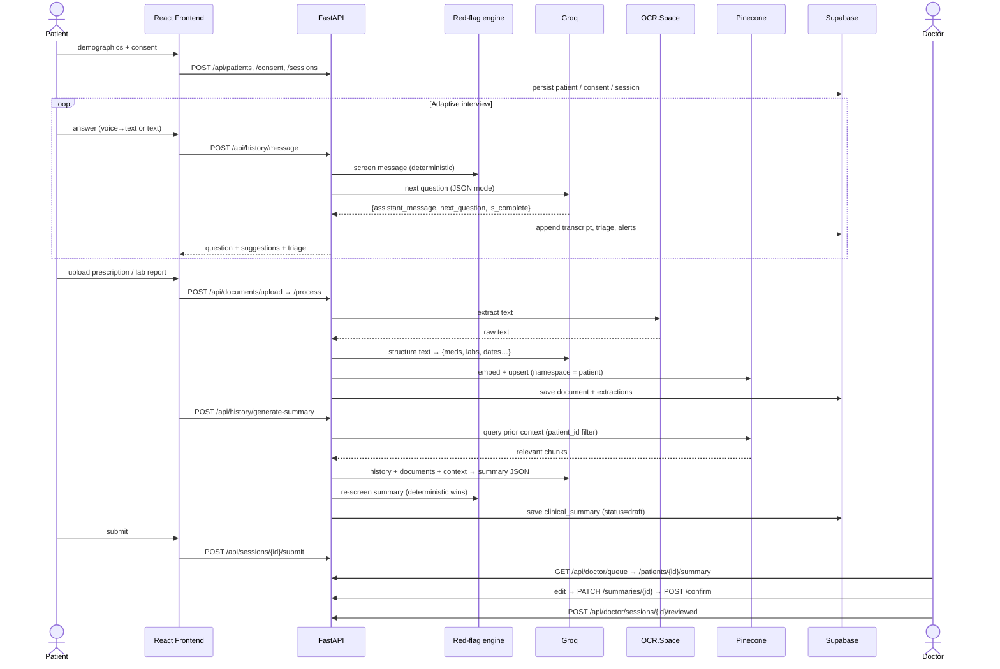

<div align="center">

# MACI
### Multilingual AI Clinical Intake Platform

**“Smarter Patient Intake. Better Clinical Conversations.”**

AI‑assisted clinical **history collection** and a **physician‑ready summary** — available on the
doctor’s dashboard *before* the consultation. The AI collects history and drafts; it **does not diagnose**.

</div>

---

## 1. Project overview

MACI is a full‑stack prototype where a patient provides their medical history by **voice or
touch/text**, uploads **prescriptions / lab reports / discharge summaries**, and receives an
AI‑generated **structured clinical history**. That history — combined with OCR‑extracted document
data and semantically retrieved prior records — is turned into a **structured, physician‑ready
summary** on a professional **doctor dashboard**, with a deterministic **red‑flag safety layer**,
a **medical timeline**, and **analytics**.

It runs **with or without** external API keys: every integration has a deterministic offline
fallback, so the app (and its test‑suite) always work.

## 2. Problem statement

Clinicians routinely start consultations with little structured information. History‑taking eats
into consultation time, prior documents arrive as unstructured scans, language barriers slow
intake, and genuine emergencies can sit unnoticed in a waiting room. MACI front‑loads a
structured, multilingual, safety‑screened intake so the clinician walks in already informed.

## 3. Features

| Area | What it does |
|------|--------------|
| **AI clinical history interview** | Adaptive, one‑question‑at‑a‑time follow‑ups (SOCRATES etc.). Collects chief complaint, HPI, PMH/PSH, medications, allergies, family & personal/social history, ROS, previous investigations. |
| **Structured, validated output** | The LLM must return JSON matching a Pydantic schema. Malformed JSON is repaired or safely rejected — the rest of the system only ever sees a valid object. |
| **Deterministic red‑flag layer** | Rule/regex engine (with negation handling) runs on **every** message and on the summary — independent of the LLM. Emergencies mark the session **HIGH PRIORITY** and raise dashboard alerts. |
| **Document intelligence** | Upload image/PDF/text → OCR.Space → LLM/heuristic structuring → medicines, doses, lab results, dates, diagnoses. User can **correct** OCR. |
| **Medical timeline** | Dates extracted from documents and arranged chronologically, ending at the current visit. |
| **RAG (Pinecone)** | Document chunks, summaries and histories are embedded and retrieved semantically — **strictly per‑patient** (namespace + mandatory `patient_id` filter). |
| **Multilingual voice** | Browser Web Speech API for ASR + speech synthesis for TTS. English + Hindi, modular for more Indian languages. |
| **Doctor dashboard** | Prioritised queue, red‑flag badges, editable AI summary (confirm / reject / notes), timeline, document intelligence, attention points, analytics cards + charts. |
| **AYUSH mode** | Optional Ayurveda intake (Prakriti, Vikriti, Sara, …), kept cleanly separate from the biomedical flow. |
| **ABDM / ABHA** | Interface + stubs for a *future/sandbox* integration (ABHA lookup, consent, FHIR export, HIS push). Nothing is transmitted. |
| **Consent** | Recorded before any intake session can be created. |

## 4. Architecture

> Full set of diagrams (sequence, ER schema, service layers, deployment) in
> **[`docs/ARCHITECTURE.md`](docs/ARCHITECTURE.md)**.

### 4.1 System flow (pipeline)



### 4.2 Architecture flow diagram (components)



### 4.3 Input / Output (I/O) diagram



### 4.4 End-to-end sequence



**Graceful degradation** — if a key is missing or a service is down:

| Missing | Fallback |
|---|---|
| Groq | Deterministic scripted interview + template summary + heuristic document structuring |
| OCR.Space | Text uploads read directly; binary files → “enter text manually” |
| Pinecone | In‑process cosine‑similarity vector store (same isolation guarantees) |
| Supabase | In‑memory repository (data lives for the process only) |
| Embedding model | Offline deterministic hashing embedder (auto‑matches the Pinecone index dimension) |

## 5. Tech stack

**Frontend** — React 18, Vite 5, Tailwind CSS 3, React Router 6, Recharts, lucide‑react,
react‑hot‑toast, Web Speech API.
**Backend** — Python 3.11+, FastAPI, Pydantic v2, pydantic‑settings, httpx, Uvicorn.
**Data** — Supabase / PostgreSQL (system of record), Pinecone (vector search).
**AI** — Groq (OpenAI‑compatible Chat Completions, JSON mode).
**OCR** — OCR.Space API.
**Embeddings** — pluggable: `fastembed` / `sentence-transformers` / offline hashing (default).
**Tests** — pytest, pytest‑asyncio (all external APIs mocked; **zero quota used**).

## 6. Folder structure

```
maci/
├── backend/
│   ├── app/
│   │   ├── api/
│   │   │   ├── routes/           # health, patients, sessions, history, voice,
│   │   │   │                     # documents, triage, doctor, summaries, ayush, abdm
│   │   │   ├── deps.py  router.py  serializers.py
│   │   ├── core/                 # config, logging (with redaction), errors
│   │   ├── models/entities.py    # persisted-entity models (mirror the DB)
│   │   ├── schemas/              # Pydantic request/response + validated LLM output
│   │   ├── services/             # groq, ocr, pinecone, embedding, red_flag,
│   │   │                         # clinical_interview, summary, timeline,
│   │   │                         # document, doctor, voice, abdm
│   │   ├── repositories/         # base + in-memory + supabase
│   │   └── main.py
│   ├── tests/                    # 60 tests, external APIs mocked
│   ├── requirements.txt  pytest.ini  Dockerfile
│
├── frontend/
│   ├── src/
│   │   ├── components/  (ui, layout, intake, doctor)
│   │   ├── lib/         (api, i18n, useVoice, format, constants)
│   │   ├── pages/       (Landing, PatientIntake, DoctorDashboard, DoctorPatient, NotFound)
│   │   ├── App.jsx  main.jsx  index.css
│   ├── package.json  vite.config.js  tailwind.config.js  Dockerfile  nginx.conf
│
├── scripts/                      # seed_demo_data · import_dataset · index_pinecone · check_groq
├── data/
│   ├── README_DATA.md            # dataset format + ingestion guide
│   ├── demo/                     # tiny demo dataset (JSONL + CSV)
│   └── real/                     # <- put YOUR dataset here (git-ignored)
├── supabase/
│   ├── migrations/0001_init.sql  # full schema (idempotent)
│   └── README.md
├── .env.example  .gitignore  docker-compose.yml  README.md
```

## 7. Setup

**Prerequisites:** Python 3.11+ and Node 18+.

```bash
# 1. Environment
cp .env.example .env          # fill in whatever keys you have (all optional)

# 2. Backend
cd backend
python -m venv .venv
# Windows:
.venv\Scripts\activate
# macOS/Linux:
source .venv/bin/activate
pip install -r requirements.txt

# 3. Frontend
cd ../frontend
npm install
cp .env.example .env          # VITE_API_BASE_URL=http://localhost:8000
```

Or everything at once with Docker: `docker compose up --build`.

## 8. Environment variables

All secrets are **backend‑only**. The frontend only ever sees `VITE_API_BASE_URL`.

| Variable | Required? | Notes |
|---|---|---|
| `GROQ_API_KEY` | optional | LLM. Without it: scripted interview + template summary. |
| `GROQ_MODEL` | optional | Default `openai/gpt-oss-20b`. `python scripts/check_groq.py` lists what your key can use. |
| `OCR_SPACE_API_KEY` | optional | Document OCR. `OCR_SPACE_API_URL` defaults to the public endpoint. |
| `PINECONE_API_KEY`, `PINECONE_HOST`, `PINECONE_INDEX_NAME` | optional | RAG. `PINECONE_DIMENSION` should match your index (offline embedder auto‑adapts at runtime). |
| `SUPABASE_URL`, `SUPABASE_KEY` | optional | Persistence. `SUPABASE_SERVICE_KEY` optional (scripts only). Needs `supabase>=2.15` for `sb_publishable_…` keys. |
| `EMBEDDING_PROVIDER` | optional | `auto` \| `fastembed` \| `sentence-transformers` \| `hash` (offline default). |
| `CORS_ORIGINS`, `API_PORT`, `MAX_UPLOAD_MB`, `MAX_INTERVIEW_QUESTIONS`, `LLM_MAX_RETRIES` | optional | See `.env.example`. |

`GET /api/health` reports which integrations are active — **booleans only, never key values**.

## 9. Supabase setup

Full guide: [`supabase/README.md`](supabase/README.md).

1. Create a project at <https://app.supabase.com>.
2. **SQL Editor → paste [`supabase/migrations/0001_init.sql`](supabase/migrations/0001_init.sql) → Run.**
   (Or `supabase db push`, or `psql … -f …`.) The migration is idempotent.
3. Put `SUPABASE_URL` + `SUPABASE_KEY` (anon/publishable) in `.env`, restart the backend.
   Startup logs `Using Supabase repository` and `/api/health` shows `"repository": "supabase"`.

RLS is intentionally **disabled** for the prototype (single server‑side key + repository‑level
patient isolation). Production requires enabling RLS with per‑role policies — see the commented
block at the end of the migration.

Tables: `patients, consents, clinical_sessions, clinical_answers, medical_histories, documents,
ocr_results, medications, allergies, lab_results, clinical_summaries, alerts, ayush_assessments`.

## 10. Pinecone setup

1. Create an index at <https://app.pinecone.io> (metric `cosine`). Note its **dimension**.
2. Set `PINECONE_API_KEY`, `PINECONE_HOST` (or `PINECONE_INDEX_NAME`), and `PINECONE_DIMENSION`
   to your index’s dimension.
3. `python scripts/index_pinecone.py --create-index` will create it for you if missing.

The offline embedder auto‑adapts to the live index dimension; if you use a real embedding model
whose dimension differs from the index, the backend logs a clear error telling you what to fix.
Retrieval is always scoped by a per‑patient namespace **and** a `patient_id` metadata filter.

## 11. OCR.Space setup

Get a free key at <https://ocr.space/ocrapi>, set `OCR_SPACE_API_KEY`. `OCR_SPACE_API_URL`
defaults to `https://api.ocr.space/parse/image`. Without a key, plain‑text/CSV/JSON uploads are
read directly and other formats prompt the user to type the text (which is then structured
normally).

## 12. Groq setup

Get a key at <https://console.groq.com/keys>, set `GROQ_API_KEY`. Then:

```bash
python scripts/check_groq.py           # lists models your key can use + tests JSON mode
```

Set `GROQ_MODEL` to one of the listed ids (default `openai/gpt-oss-20b`; `openai/gpt-oss-120b`
for higher quality). All Groq calls use JSON mode with a retry + repair loop.

## 13. Running the backend

```bash
cd backend
uvicorn app.main:app --reload --port 8000
# API:   http://localhost:8000
# Docs:  http://localhost:8000/docs
# Health http://localhost:8000/api/health
```

## 14. Running the frontend

```bash
cd frontend
npm run dev            # http://localhost:5173  (proxies /api -> :8000)
npm run build          # production build -> dist/
npm run preview        # serve the build
```

## 15. Dataset import

Nothing large is bundled. Provide your dataset later and import it **without changing app code** —
full guide in [`data/README_DATA.md`](data/README_DATA.md).

```bash
# minimal demo (verify the app)
python scripts/seed_demo_data.py

# your dataset  (CSV / JSON / JSONL, "unified intake record" shape)
python scripts/import_dataset.py --path data/real/intake.jsonl --dry-run
python scripts/import_dataset.py --path data/real/intake.jsonl

# (re)build the vector index
python scripts/index_pinecone.py --all
```

> Put your real files in **`data/real/`** (git‑ignored). Document scans can also be uploaded
> through the running app at `POST /api/documents/upload`.

## 16. API documentation

Interactive docs: **`/docs`** (Swagger) and **`/redoc`**. Key endpoints:

| Method & path | Purpose |
|---|---|
| `GET /api/health` | Status + active integrations (booleans) |
| `POST /api/patients` · `GET /api/patients/{id}` · `PATCH /api/patients/{id}` | Patients |
| `POST /api/patients/{id}/consent` | Record consent (required before a session) |
| `POST /api/sessions` · `GET /api/sessions/{id}` · `PATCH …` | Intake sessions |
| `GET /api/sessions/{id}/interview` · `POST /api/sessions/{id}/submit` | Transcript · submit to doctor |
| `POST /api/history/message` | One adaptive interview turn (+ deterministic triage) |
| `POST /api/history/generate-summary` | Build the structured physician‑ready summary |
| `POST /api/voice/transcript` · `POST /api/voice/speak` | Voice ASR intake · TTS params |
| `POST /api/documents/upload` · `POST /api/documents/{id}/process` · `GET /api/documents/{id}` · `PATCH /api/documents/{id}` | Upload · OCR+structure · fetch · correct |
| `POST /api/triage/check` | Deterministic (optionally + LLM) red‑flag screen |
| `GET /api/doctor/queue` · `GET /api/doctor/analytics` | Dashboard queue · analytics |
| `GET /api/doctor/patients/{id}/summary` | Full patient view (overview, summary, docs, timeline, AYUSH) |
| `POST /api/doctor/sessions/{id}/reviewed` | Mark patient reviewed |
| `GET /api/summaries/{id}` · `PATCH …` · `POST …/confirm` · `POST …/reject` | Review the AI summary |
| `POST /api/ayush/assessment` · `GET /api/ayush/assessment/{session_id}` | AYUSH mode |
| `GET /api/abdm/status` · `POST /api/abdm/abha/lookup` · `POST /api/abdm/consent` · `GET /api/abdm/fhir/{session_id}` | **Future/sandbox** stubs |

## 17. Screenshots

_Add screenshots/GIFs here._

| | |
|---|---|
| `docs/screenshot-landing.png` | Landing page |
| `docs/screenshot-intake.png` | Patient kiosk — adaptive interview |
| `docs/screenshot-documents.png` | Document intelligence + OCR correction |
| `docs/screenshot-dashboard.png` | Doctor dashboard queue + analytics |
| `docs/screenshot-summary.png` | Editable AI clinical summary + timeline |

## 18. Security notes

Prototype‑level, defence‑in‑depth:

- Secrets are **backend‑only**; `.env` is git‑ignored; `.env.example` has placeholders only.
- All paid/external API calls happen server‑side. `/api/health` never returns key values.
- Logging has a **redaction filter** for key patterns and obvious PII; patient content is not logged.
- Upload validation: extension + MIME allow‑list, size limit, empty‑file rejection.
- Input validation everywhere via Pydantic; errors return a small safe envelope (no stack traces).
- Configurable **CORS** allow‑list.
- **Patient isolation**: repository‑level ownership checks + Pinecone per‑patient namespace + a
  mandatory `patient_id` metadata filter on every retrieval (`query()` refuses to run without one).
- **Consent** is recorded before a session can start.
- The patient is never told an AI diagnosis is confirmed; red‑flag messaging is “contact staff”, not a diagnosis.

> **Not certified.** This prototype is **not** HIPAA, India DPDP, or ABDM compliant/certified.
> Production deployment requires enabling RLS, encryption, audit logging, PII minimisation, and a
> **formal security & compliance review**.

## 19. Limitations

- The AI **collects history and drafts**; it does not diagnose, triage definitively, or treat.
- Voice uses the **browser** Web Speech API — quality and language support vary by browser
  (Chrome is best); there is no server ASR yet.
- The default embedder is a deterministic **hash** embedder — stable and offline, but not
  semantically rich. Install `fastembed`/`sentence-transformers` and set `EMBEDDING_PROVIDER` for real embeddings.
- Heuristic document structuring (no‑LLM fallback) is regex‑based and best‑effort.
- Without Supabase, data is **in‑memory** and lost when the process stops.
- ABDM/ABHA is a **stub** — no real gateway calls.
- No auth/RBAC yet — the doctor dashboard is open in the prototype.

## 20. Future roadmap

- Real auth + RBAC (patient / clinician / admin), Supabase RLS policies, audit trail.
- Server‑side multilingual ASR/TTS provider behind the existing modular voice seam; more Indian languages.
- Real ABDM sandbox integration (ABHA, consent artefacts, FHIR R4 bundles, HIS push).
- Better retrieval: real embedding model by default, hybrid search, re‑ranking.
- Clinician feedback loop to fine‑tune prompts; structured coding (SNOMED/LOINC/ICD).
- FHIR export of the confirmed summary; EMR write‑back.
- Admin console (users, departments, templates, analytics export).
- Formal security & compliance review; load/soak testing; observability.

---

### Quick start (TL;DR)

```bash
cp .env.example .env
cd backend && python -m venv .venv && . .venv/Scripts/activate && pip install -r requirements.txt
uvicorn app.main:app --reload            # terminal 1
cd ../frontend && npm install && npm run dev   # terminal 2
python ../scripts/seed_demo_data.py      # optional demo data
# open http://localhost:5173
```

Run the backend tests (no API quota used):

```bash
cd backend && pytest
```
