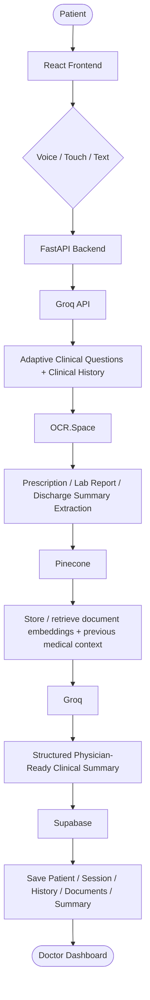
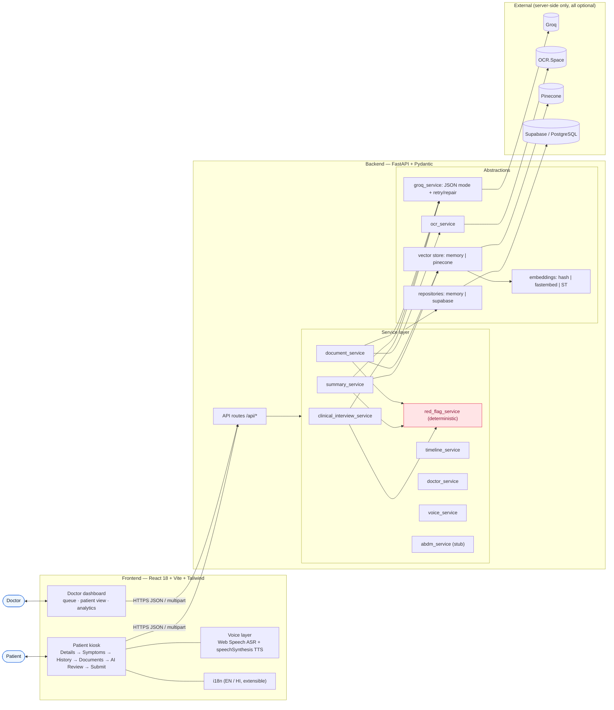
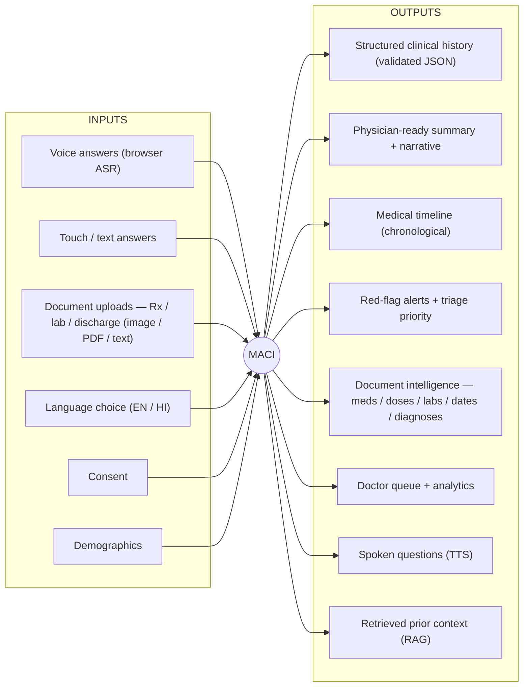
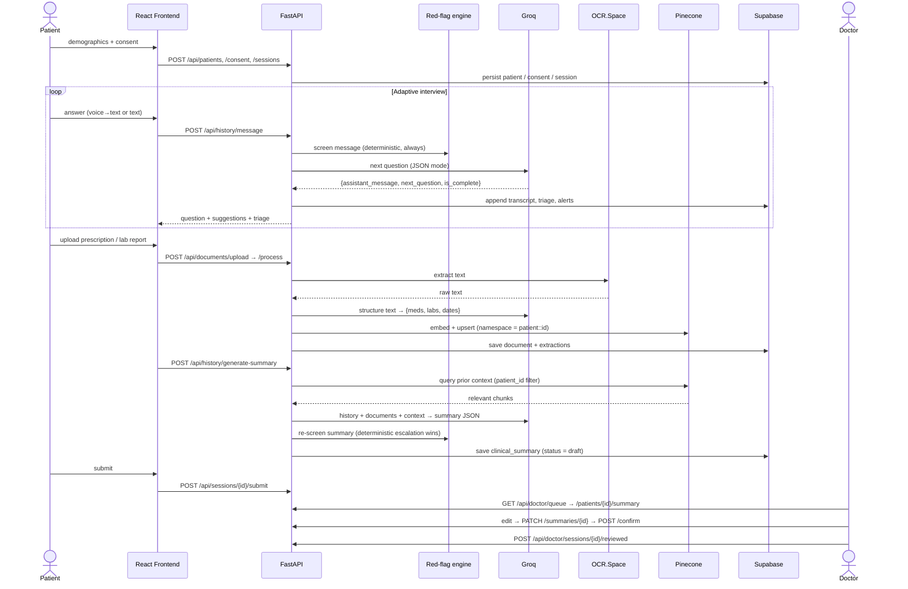
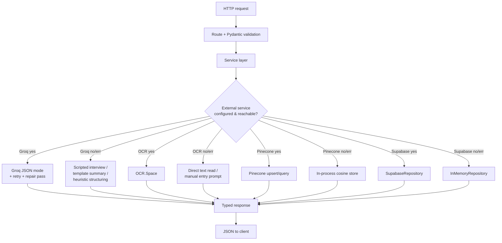
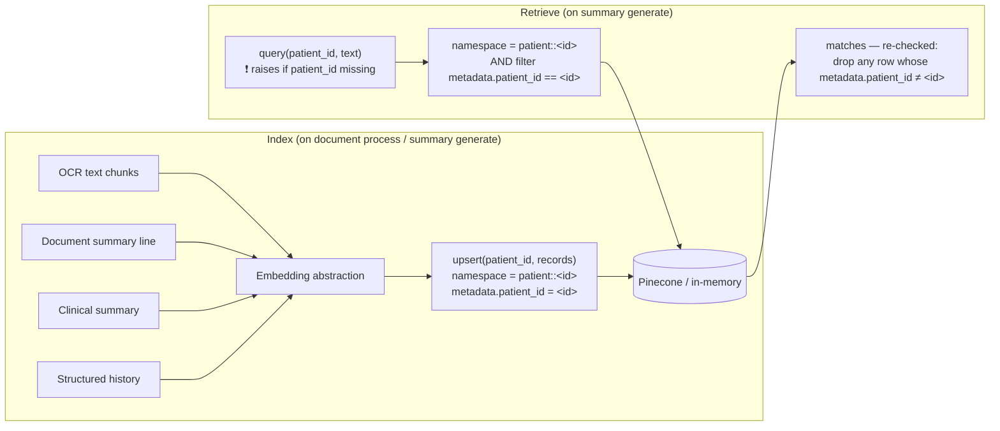
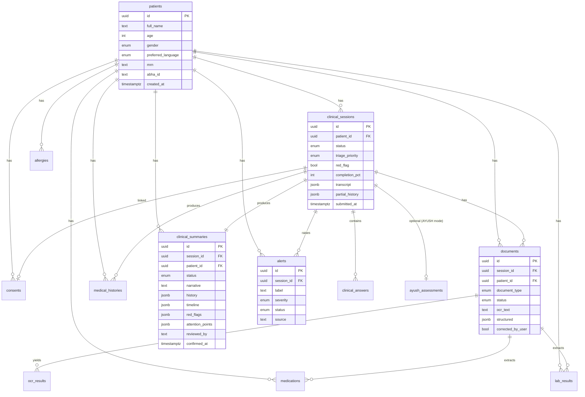
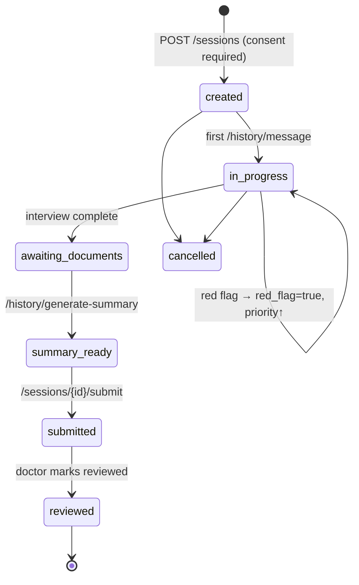
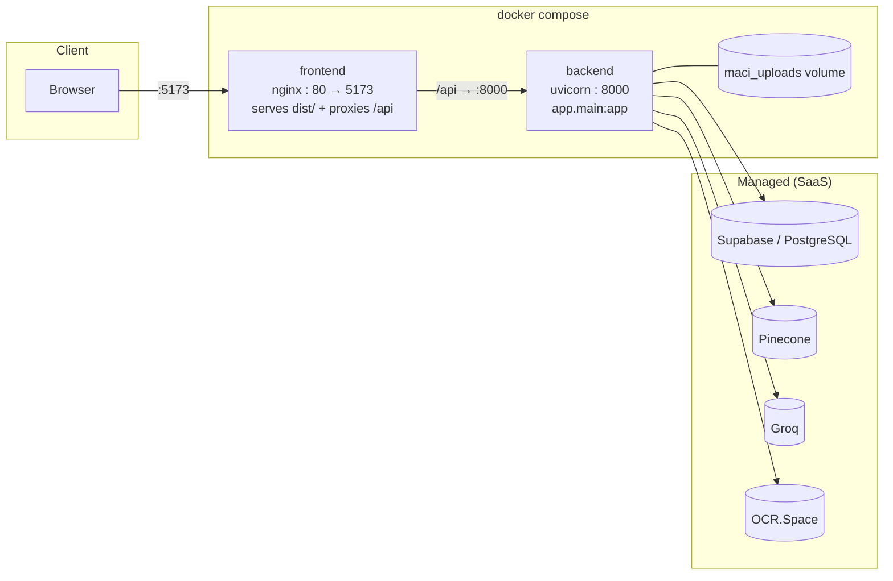

# MACI — Architecture & Diagrams

Companion to the root [`README.md`](../README.md) §4. All diagrams are Mermaid
(they render on GitHub).

- [1. System flow (pipeline)](#1-system-flow-pipeline)
- [2. Component / architecture flow](#2-component--architecture-flow)
- [3. Input / Output (I/O) diagram](#3-input--output-io-diagram)
- [4. End-to-end sequence](#4-end-to-end-sequence)
- [5. Backend layers & graceful degradation](#5-backend-layers--graceful-degradation)
- [6. Red-flag safety decision flow](#6-red-flag-safety-decision-flow)
- [7. RAG & patient isolation](#7-rag--patient-isolation)
- [8. Database schema (ER)](#8-database-schema-er)
- [9. Patient intake state machine](#9-patient-intake-state-machine)
- [10. Deployment](#10-deployment)

---

## 1. System flow (pipeline)



---

## 2. Component / architecture flow



---

## 3. Input / Output (I/O) diagram



| Input | Consumed by | Produces |
|---|---|---|
| Voice / text answer | `POST /api/history/message` → interview service | next question, `suggested_replies`, triage, partial history |
| Document upload | `POST /api/documents/upload` + `/process` | OCR text, `StructuredDocument`, `medications`/`lab_results` rows, vectors |
| "Generate summary" | `POST /api/history/generate-summary` | `ClinicalSummary` (history JSON + narrative + timeline + red flags + attention points) |
| Submit | `POST /api/sessions/{id}/submit` | session `status=submitted`, appears on doctor queue |
| Doctor edit / confirm | `PATCH/POST /api/summaries/{id}` | `status=edited|confirmed|rejected`, doctor notes |

---

## 4. End-to-end sequence



---

## 5. Backend layers & graceful degradation



The choice is logged at startup and surfaced at `GET /api/health`
(`integrations` booleans + `runtime.repository` / `runtime.vector_store`).

---

## 6. Red-flag safety decision flow

```mermaid
flowchart TD
    MSG[Patient message / summary text] --> RULES[Deterministic rule + regex engine]
    RULES --> NEG{Negated?<br/>"no", "denies", "without"…}
    NEG -- yes --> DROP[Ignore match]
    NEG -- no --> HIT[Record RedFlagHit<br/>rule_id · category · severity]

    HIT --> SEV{Highest severity}
    SEV -- emergency/urgent --> ESC[red_flag = true<br/>priority = emergency/urgent]
    SEV -- none --> OKk[priority = standard]

    subgraph OPT["Optional additive LLM screen (never removes a rule hit)"]
        LLMS[llm_safety_review]
    end
    ESC --> MERGE[merge_triage]
    OKk --> MERGE
    LLMS --> MERGE

    MERGE --> ACT["Patient: 'Potential urgent symptom detected.<br/>Please contact medical staff immediately.'<br/>(never a diagnosis)"]
    MERGE --> DBW[session.red_flag = true<br/>session.triage_priority ↑<br/>create alerts row]
    DBW --> DASH[Doctor dashboard: HIGH PRIORITY badge + alert]
```

Key rule: **the deterministic layer always wins on escalation** — the LLM can
add concerns but can never downgrade or clear a rule-based red flag.

---

## 7. RAG & patient isolation



Three independent guards: per-patient **namespace**, mandatory **metadata
filter**, and a **post-query re-check**. One patient's records can never surface
for another.

---

## 8. Database schema (ER)



Full DDL: [`../supabase/migrations/0001_init.sql`](../supabase/migrations/0001_init.sql).
Vector embeddings are **not** stored here — they live in Pinecone.

---

## 9. Patient intake state machine



---

## 10. Deployment



`docker compose up --build` — frontend on `:5173`, backend on `:8000`. No local
database container by design (PostgreSQL is Supabase-hosted). The app still runs
with none of the managed services configured.
